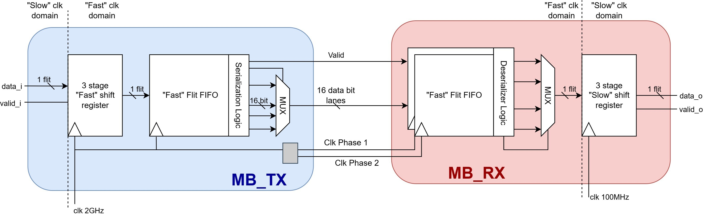
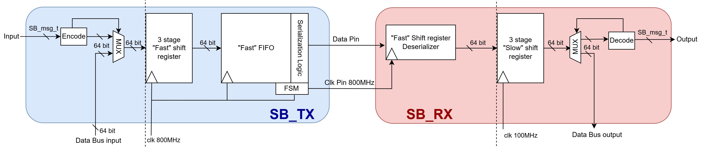
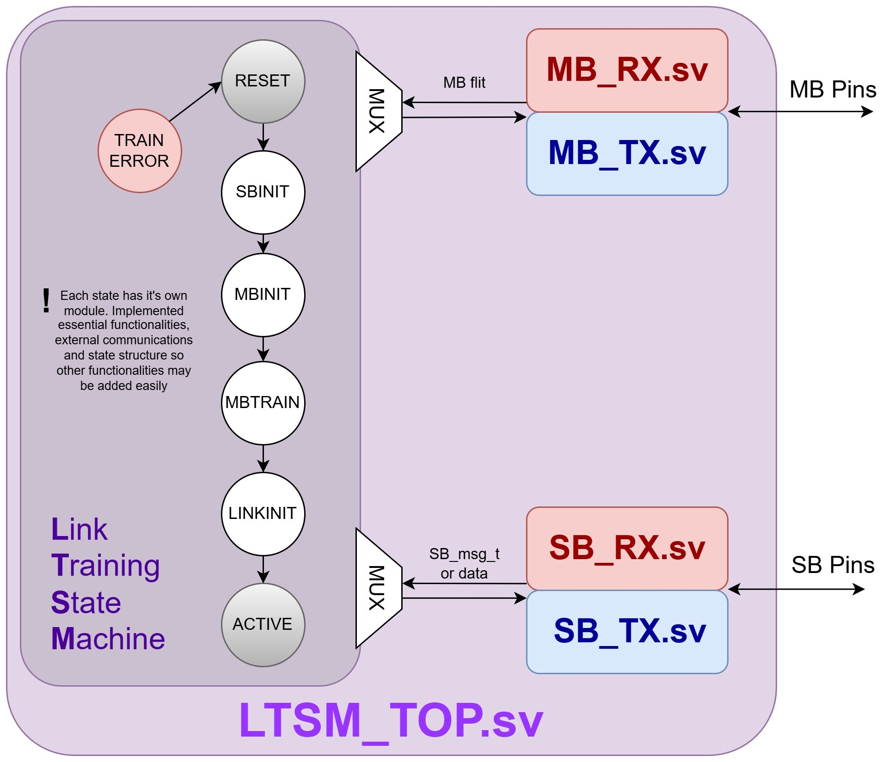

# UCIe
TFM repo for implementation of UCie v2.0 protocol

Aiming for standard package 16 lanes with the following functionalities (for now):
- :green_circle: Data transfer in MainBand
- :green_circle: Sideband Communication
- :yellow_circle: Link state management
    - :green_circle: Transition through all states with link partner to ACTIVE
    - :green_circle: Empty shell for each LT state, able to add extra functionality in the future
    - :red_circle: Link parameter negotiation

The following diagrams show the structure of the implementation done in this repo:

